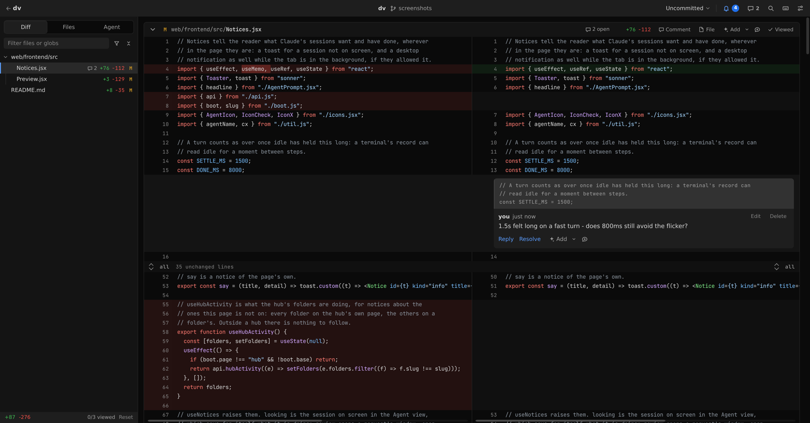
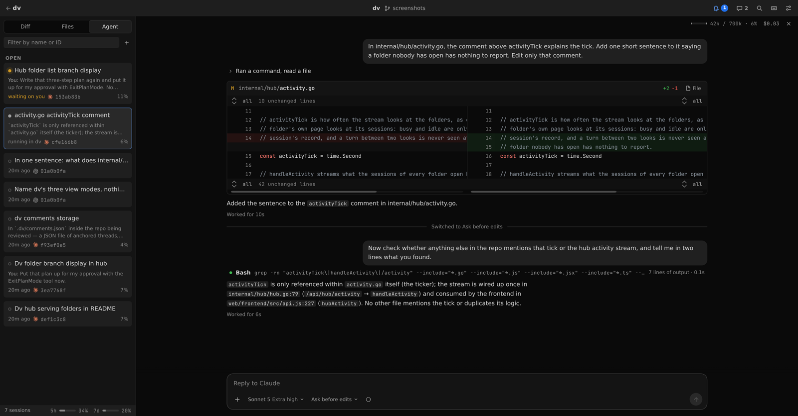
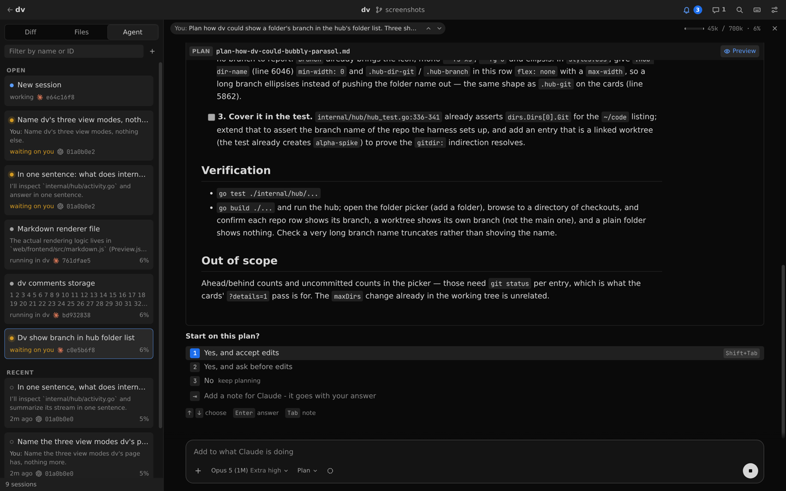
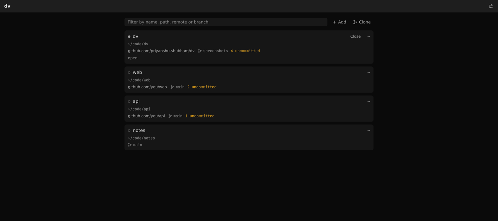

# dv

A local place to review code and work with Claude Code and Codex, in the
browser - a phone's too.

- **Diff** - your changes, a branch or any commits, with comments on any line
  that can be added to a message for Claude or Codex. Markdown takes them read
  rendered as well, and any file takes one on the file itself - a picture or
  something binary included.
- **Files** - the whole repository, or any branch or commit, to read and
  comment on.
- **Agent** - Claude Code's and Codex's sessions beside the code: their edits
  show as diffs you can comment on, the comments go with your next message, and
  their permission prompts are answered in the page. A plan comes up for
  approval with its lines open to comments. A message starting with `!` runs
  in your shell, as in the terminal, and the agent is sent what it printed.

Run `dv` in a git repository and it prints a URL. Comments are kept in a file
inside the repository that git never sees. Outside git, the same page opens on
the folder's files, without the diff.

```
$ cd ~/code/my-project
$ dv

  my-project — reviewing /home/you/code/my-project
  http://127.0.0.1:41207
  comments → /home/you/code/my-project/.dv/comments.json

  ctrl-c to stop
```

`dv hub` serves many folders from one address instead, with a page to add
folders, clone repositories and make worktrees - see [Hub](#hub).

In a folder's page, `?` lists the keyboard shortcuts.

## Screenshots

Your changes, side by side, with a comment left on the lines it is about.



Claude Code beside the code: what it ran folded away, the edit it made as a
diff to read and comment on, and how long each turn took. Down the side, the
sessions of both agents - working, waiting on you, or done.



A plan comes up as the document it is, its steps open to comments that go with
your answer.



`dv hub` holds many folders on one address, each saying what it is doing.



## Install

```
curl -fsSL https://raw.githubusercontent.com/priyanshu-shubham/dv/main/install.sh | sh
```

That fetches the latest release for your machine — Linux or macOS, x86-64 or
ARM — checks it against the release's checksums, and puts `dv` in
`~/.local/bin`. `DV_VERSION=v0.2.0` pins a release and `DV_INSTALL_DIR` picks
another directory. On Windows, take the zip from the
[releases page](https://github.com/priyanshu-shubham/dv/releases).

dv needs `git` for the diff, and the `claude` or `codex` CLI on your PATH for
the Agent view. `rg` is used for text search when present, with a built-in scanner as the
fallback.

To build it yourself: `make install`, with Go 1.24+ and Node.

A running dv picks up a newly installed one with Settings → Restart, or
`curl -X POST -H 'Content-Type: application/json' <dv's address>/api/restart`.

## Hub

```
$ dv hub

  dv hub — 3 folders
  http://127.0.0.1:41000

  ctrl-c to stop
```

`dv hub` is one dv for many folders on one port: each folder's page is at
`/<name>/`, so a single address - or a single tunnel to a phone - reaches all of
them. `dv` in a folder a hub is serving prints the hub's address for it and
exits, and `dv hub` with a hub already on the port opens that one. An agent
that finishes, or wants an answer, is told of wherever you are: on another
folder's page or on the hub's own, named by its folder.

- `-host 0.0.0.0` reaches the hub from other devices on your network, where
  **anyone who can reach the port can add folders, clone and run Claude or Codex
  in them**.
  Over plain http from another device, browsers allow neither desktop
  notifications nor pasting a copied image; a tunnel with https gives both.
- Clones use your own git credentials and never stop to ask for a password or a
  host key, so one that needs either fails and says why.
- A Claude Code session in a cloned repository uses that repository's own
  settings and hooks, so clone what you trust.
- Worktree hooks are kept in the hub, never committed to the repository.

## Flags

```
-C <dir>      repository to review (default: the current directory)
-port <n>     port to listen on (default: one derived from the repository's path,
              in 41100-41999, so each repository keeps its own URL)
-host <addr>  address to bind (default: 127.0.0.1)
-no-open      don't open a browser
-version      print the version
```

`dv hub` takes `-port` (default 41000), `-host` and `-no-open`.

`dv reset` deletes the review — every comment and viewed mark — after asking.
`-y` skips the question, and is needed when stdin is not a terminal.

## What dv keeps, and where

In the repository, in `.dv/` at its root:

- `comments.json` — the comments
- `viewed.json` — files marked viewed, per comparison
- `prefs.json` — the file filters, unsent messages to Claude and what is added
  to them, half-answered questions
- `agent.json` — the sessions open in dv and which are Codex's, rewinds not yet
  sent, and where you changed a session's permission mode
- `server.json` — the address of the dv running here

On first run dv adds `/.dv/` to `.git/info/exclude`, so none of it shows in
`git status` or gets committed, and your `.gitignore` stays untouched. Outside
git there is nothing to add it to, so ignore `.dv/` yourself.

In your config folder (`~/.config/dv` on Linux): `prefs.json`, the settings that
follow you to every repository and device - theme, code colours, sidebar side,
context, Markdown previews, whether added-to sessions start temporary - and
`hub.json`, the hub's folders. What suits one
screen - split or unified, wrapping, panel widths, desktop notifications - stays
in the browser.

The comments file is meant to be handed to an agent along with "address these":

```json
{
  "format": 1,
  "repo": "my-project",
  "threads": [
    {
      "id": "t_9f2c...",
      "file": "internal/server/handlers.go",
      "side": "new",
      "startLine": 88,
      "endLine": 91,
      "quote": ["\tif err != nil {", "\t\treturn err", "\t}"],
      "scope": "Uncommitted",
      "baseSha": "fa4ae86",
      "resolved": false,
      "comments": [{ "id": "c_1a...", "author": "you", "body": "this swallows the cause" }]
    }
  ]
}
```

`quote` holds the lines the thread was attached to, so a comment can still be
found after the code under it moves.

## Rules the page applies

**Generated files** are listed but their diff is not shown until asked for. A
file counts as generated if its path says so (lock files, `vendor/`,
`node_modules/`, `*.pb.go`, `*.min.js`, `__snapshots__/` and the like), if its
first lines carry a `generated … do not edit` banner, or if `.gitattributes`
marks it `linguist-generated`, which overrules the guesses.

**Include and exclude** take comma-separated globs. A pattern without a slash
matches a file or folder name anywhere, one with a slash is anchored at the
repository root, and a folder takes everything inside it.

**Go to definition** is built into dv, from the files git tracks, with nothing
to install. It knows Go, JavaScript and TypeScript, Python, Rust, Ruby, Java,
Kotlin, Scala, C#, C, C++, Objective-C, PHP, shell, SQL, Protocol Buffers,
Terraform and HCL, CSS, Elixir, Lua and Swift, plus Makefile targets and
Markdown headings.

**Outside git**, the file listing leaves out `node_modules`, `.venv`,
`__pycache__`, `.cache` and version control's folders, and stops at 50,000
files.

## Claude Code

dv runs sessions through the `claude` CLI, with your Claude Code settings and
login; `/login` does not work from dv, so log in from a terminal. A session open
in a terminal can be read in dv but not written to, since two writers would fork
its transcript.

**Prompts from terminal sessions**, in Settings, lets sessions running in a
terminal ask for permission in dv too. It adds three hooks to
`~/.claude/settings.json` (or `$CLAUDE_CONFIG_DIR`), beside any you have. Each
runs `dv claude hook`, which does nothing when no dv is open on the session's
repository, so Claude Code behaves as always elsewhere. If dv moves, the next dv
to start points the hooks at itself. **Turn the setting off before removing
dv**, or the hooks are left running a binary that is not there.

## Codex

dv runs Codex through `codex app-server`, with your Codex config and login: one
for every folder dv has open, started when the Agent view needs it and stopped
a few minutes after nothing does. A new session picks Claude or Codex beside
its model. The list has the folder's Codex sessions from Codex's own history;
one open in a terminal is followed read-only, and its prompts stay the
terminal's.

The permission modes are made of Codex's sandbox and approvals, which cover
commands and edits together rather than one at a time as Claude Code's do:
**Ask before edits** keeps the sandbox read-only and asks for anything but a
command Codex trusts, **Accept edits** lets it work inside the folder - writing
there and running commands that stay in the sandbox, without the network - and
asks to go beyond that, **Plan** is Codex's plan mode, and **Auto** has Codex's
reviewer answer instead of you. Asked to go beyond its sandbox, Codex says why,
which the request shows. A mode or model picked while Codex works takes effect
from its next turn. A message sent while it works waits two seconds, when Esc takes it
back, and then joins the turn. `/review` has Codex review what is uncommitted,
or what you describe after it. Rewinding restores the conversation only: Codex
keeps no copies of the files it changes.

## License

MIT — see [LICENSE](LICENSE). The UI ships JetBrains Mono, under the SIL Open
Font License 1.1.
